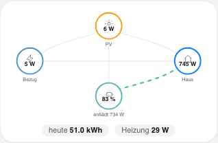
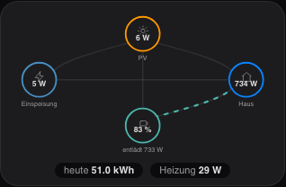

# Compact Power Flow Card

A compact, dependency-free power-flow card for Home Assistant: PV, grid, house
and battery as ring nodes with animated flow paths, plus optional chips for
daily yield, EV charger and heat pump. Tesla-style level of detail in roughly a
third of the space.

 

## Why another power flow card?

- **Compact** — a single `ha-card`, ~4 grid rows in a sections view, degrades
  gracefully down to phone width (390 px).
- **Zero dependencies** — one plain ES module (HTMLElement + Shadow DOM). No
  Lit bundle, no chart library.
- **Efficient** — no polling, no timers: the card re-renders only when one of
  its configured entities actually changes state. Flow animation is pure CSS.
- **Theme-aware** — uses HA's `--energy-*-color` and text/background theme
  variables with sensible fallbacks; adapts to light/dark automatically.
- Flow dash speed scales with power (4 s at ~50 W down to 0.8 s at ≥ 5 kW);
  flows below 25 W are hidden.

## Installation

### HACS (custom repository)

1. HACS → three-dot menu → *Custom repositories*
2. Repository: `stefanschaedeli/compact-power-flow-card`, type: *Dashboard*
3. Install **Compact Power Flow Card**, reload your browser.

### Manual

Copy `compact-power-flow-card.js` to `/config/www/` and register a dashboard
resource:

```yaml
url: /local/compact-power-flow-card.js
type: module
```

## Configuration

The card displays five directional flows. Each flow is fed by its own sensor
(magnitude in W, ≥ 0); most hybrid-inverter integrations (SMA, Fronius,
Victron, …) expose these directly.

```yaml
type: custom:compact-power-flow-card
entities:
  pv_total: sensor.pv_power_total            # required
  pv_to_house: sensor.pv_to_house            # required
  pv_to_battery: sensor.battery_charge_power # required
  pv_to_grid: sensor.grid_export_power       # required
  battery_to_house: sensor.battery_discharge_power # required
  grid_to_house: sensor.grid_import_power    # required
  battery_soc: sensor.battery_soc            # required (%)
  house: sensor.house_consumption            # required
  daily_yield: sensor.pv_daily_yield         # optional (Wh/kWh/MWh, auto-scaled)
  ev: sensor.wallbox_power                   # optional chip
  heatpump: sensor.heatpump_power            # optional chip
```

### Labels

All visible texts default to German and can be overridden:

```yaml
labels:
  pv: PV
  grid: Grid
  house: Home
  battery: Battery
  grid_import: import
  grid_export: export
  battery_charge: charging
  battery_discharge: discharging
  daily_yield: today
  ev: Car
  heatpump: Heating
```

### Behavior details

- **Grid node** shows whichever is larger of import/export with the matching
  label.
- **Battery node** shows SOC inside the ring; charging/discharging power (net
  of the charge and discharge sensors) appears beneath it when above 25 W.
- **Unavailable sensors** render as `–` and their flows stay hidden — the card
  never throws on missing states.
- Sizing in sections views: defaults to 12 columns × 4 rows
  (`min_columns: 6`, `min_rows: 3`) via `getGridOptions()`.

## License

[MIT](LICENSE)
